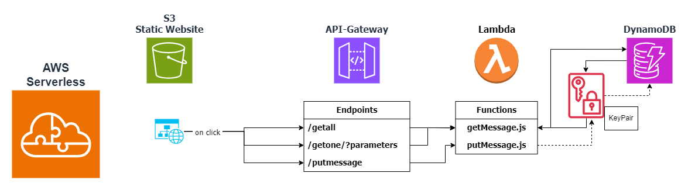

# Serverless Messaging Service 

This service enables you to leave a password protected message for another user.
The message is encrypted / decrypted through a Lambda function and stored in a DynamoDB.
When the message is retrieved with the right password, the message will be displayed for the recipient and deleted from the DynamoDB.

---

## Technical Details

---

### Architecture

---

This simple static Website leverages 4 AWS Services:
- **S3** for hosting the static website
- **API Gateway** that triggers Lambda functions
- **Lambda** that perform the operations as **encryption** and **decryption** on the message before sending to DynamoDB for storage
- **DynamoDB** for storing the data

---

### Code

The Website is written in vanilla **HTML**, **CSS** and **JavaScript**. The Lambda functions are written in **Javascript/NodeJs**.

The encryption and decryption are done with the [crypto-js](https://www.npmjs.com/package/crypto-js) library.

---

### Hosting

The Website can currently be visited [here](http://burn2read-468731583.s3-website.eu-central-1.amazonaws.com/)