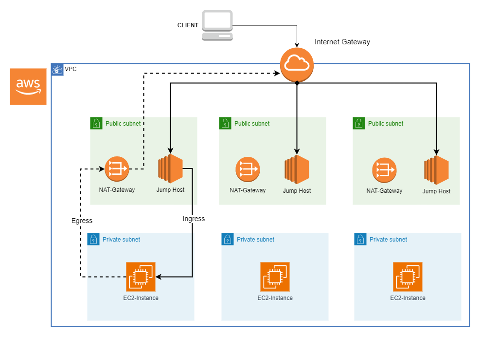

# VPC with Private and Public Subnets, NAT Gateways, and Jumphosts

This is a Terraform module which deploys a VPC on AWS with private and public subnets, NAT gateways, and jumphosts. It configures the subnets, route tables and NAT & Internet-Gateways and launches EC2 instances for the jumphosts in the public subnets as well as Server-Instances in the private subnets.

---
## Design 

---
## How to Connect to the Servers in the private subnets 
- Connect to the jumphosts via SSH
- Send the SSH key to the jumphosts via SSH / SCP
- Use the private IP-Adresses from Terraform-Outputs to connect to the private Servers via SSH from the jumphosts