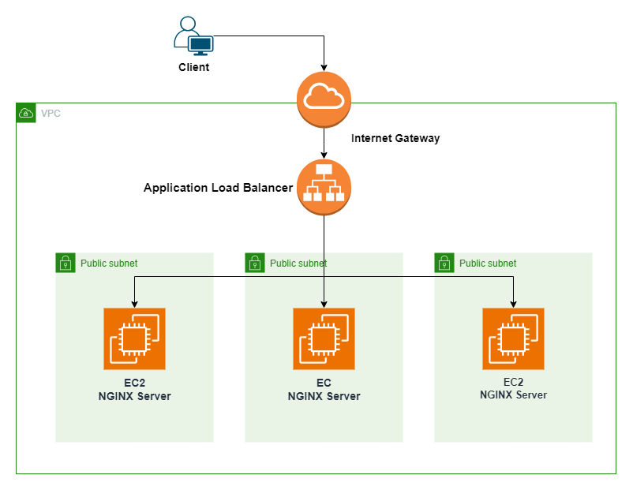

# Application Load Balancer 

This is a Terraform Project which sets up an Application Load Balancer targeting three NGINX-Servers in three different public Subnets.

---

## Design 

---

## How to Connect to the Servers 

The Terraform Outputs provides the DNS-Name of the Load Balancer.